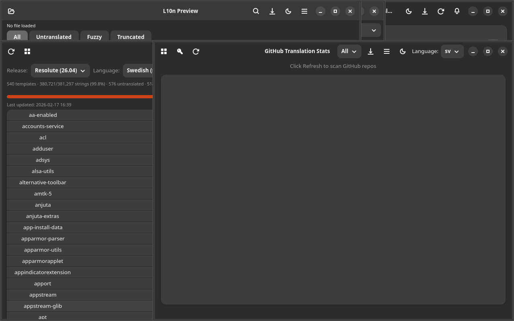
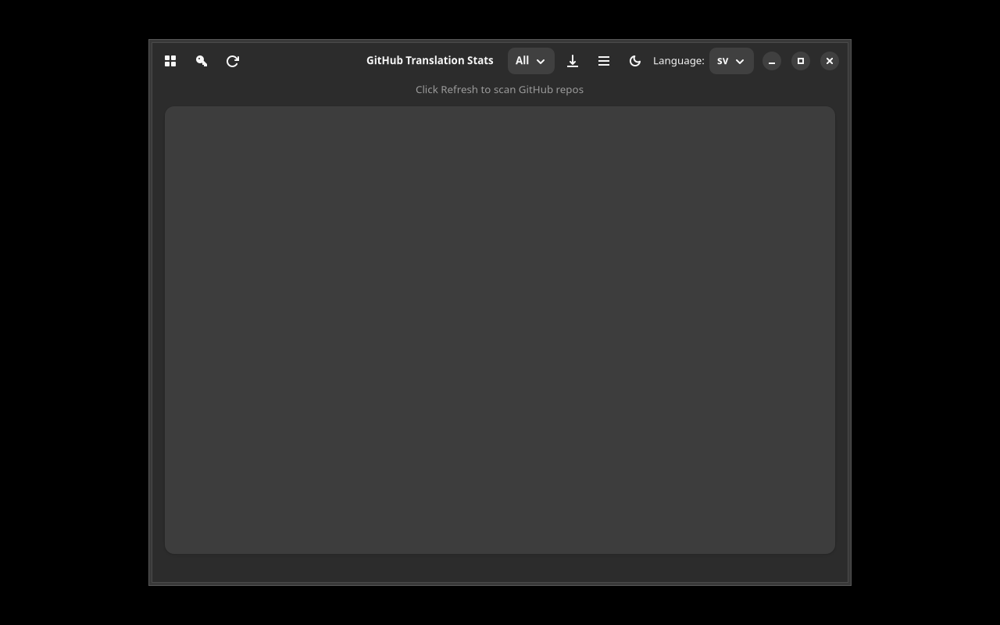

# GitHub Translation Stats

## Screenshot



A GTK4/Adwaita application that scans popular open-source GitHub repositories and shows which ones have (or lack) translations for a given language.



## Features

- Lists top GitHub repos by stars with their l10n status
- Searches for `.po`, `.ts`, `.xliff` files per language
- Filter: All / Without translation / With translation
- Drill-down: click a repo to see its translation files
- Links to repos and specific translation files on GitHub
- Optional GitHub personal access token for higher rate limits
- Local cache with 1h TTL
- Language selector supporting 15+ languages

## Installation

### Debian/Ubuntu

```bash
# Add repository
curl -fsSL https://yeager.github.io/debian-repo/KEY.gpg | sudo gpg --dearmor -o /usr/share/keyrings/yeager-archive-keyring.gpg
echo "deb [signed-by=/usr/share/keyrings/yeager-archive-keyring.gpg] https://yeager.github.io/debian-repo stable main" | sudo tee /etc/apt/sources.list.d/yeager.list
sudo apt update
sudo apt install github-l10n
```

### Fedora/RHEL

```bash
sudo dnf config-manager --add-repo https://yeager.github.io/rpm-repo/yeager.repo
sudo dnf install github-l10n
```

### From source

```bash
pip install .
github-l10n
```

## 🌍 Contributing Translations

This app is translated via Transifex. Help translate it into your language!

**[→ Translate on Transifex](https://app.transifex.com/danielnylander/github-l10n/)**

Currently supported: Swedish (sv). More languages welcome!

### For Translators
1. Create a free account at [Transifex](https://www.transifex.com)
2. Join the [danielnylander](https://app.transifex.com/danielnylander/) organization
3. Start translating!

Translations are automatically synced via GitHub Actions.
## License

GPL-3.0-or-later — Daniel Nylander <daniel@danielnylander.se>
